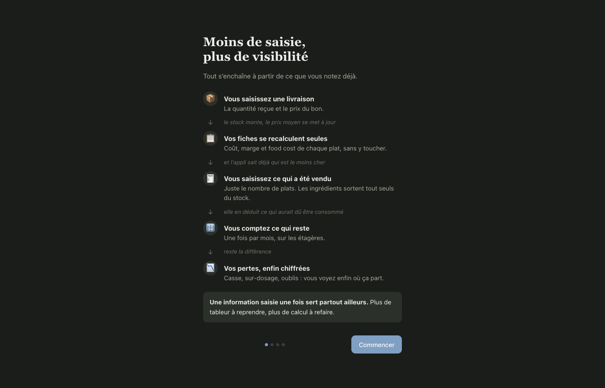
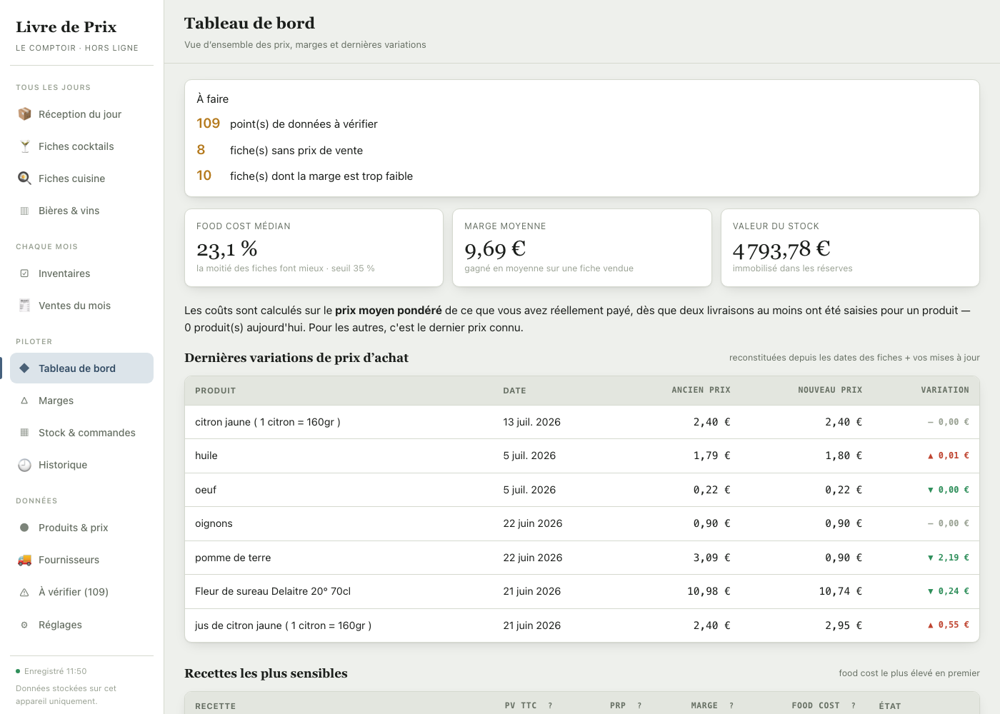
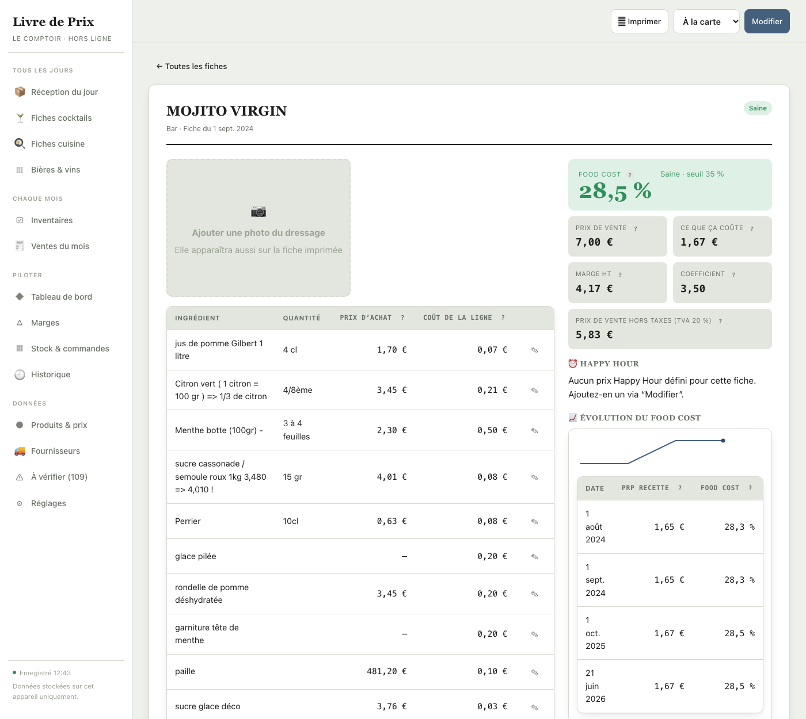
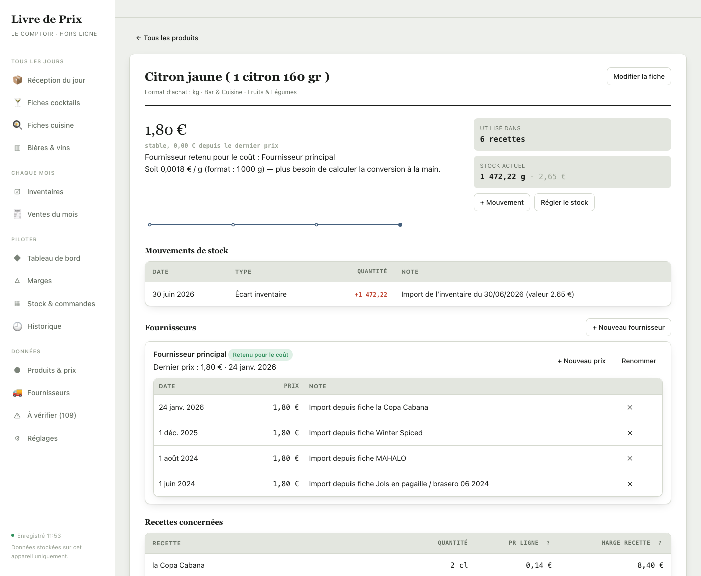
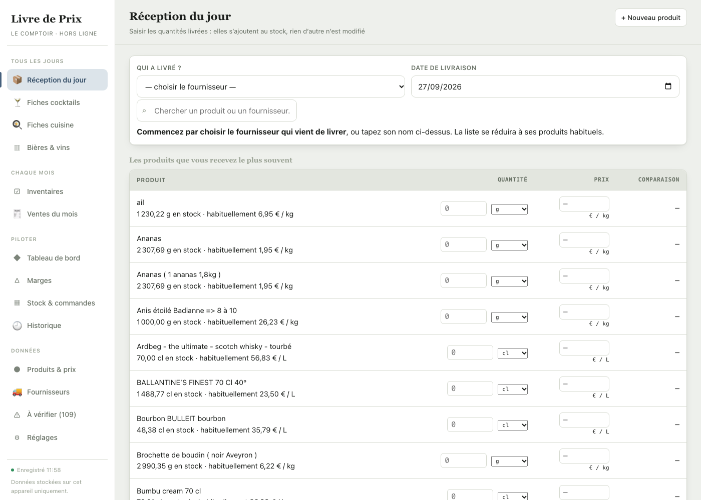
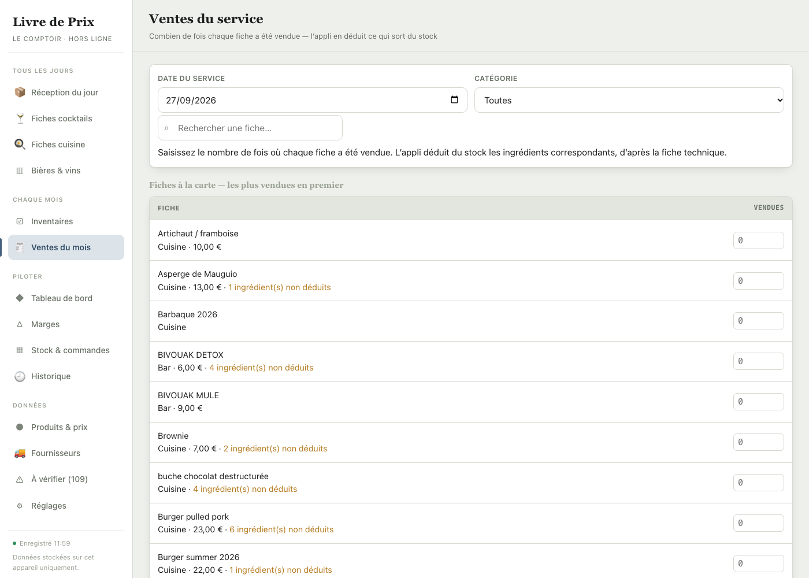
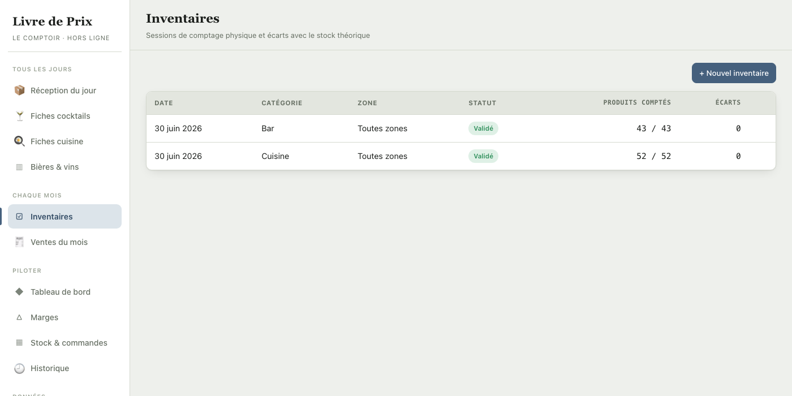
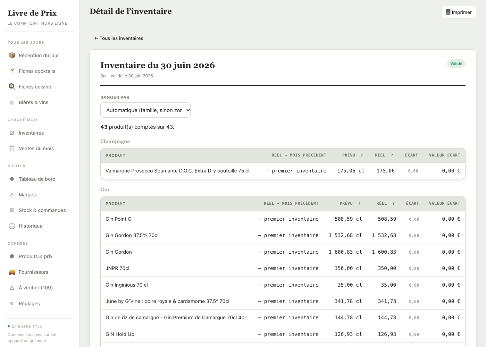
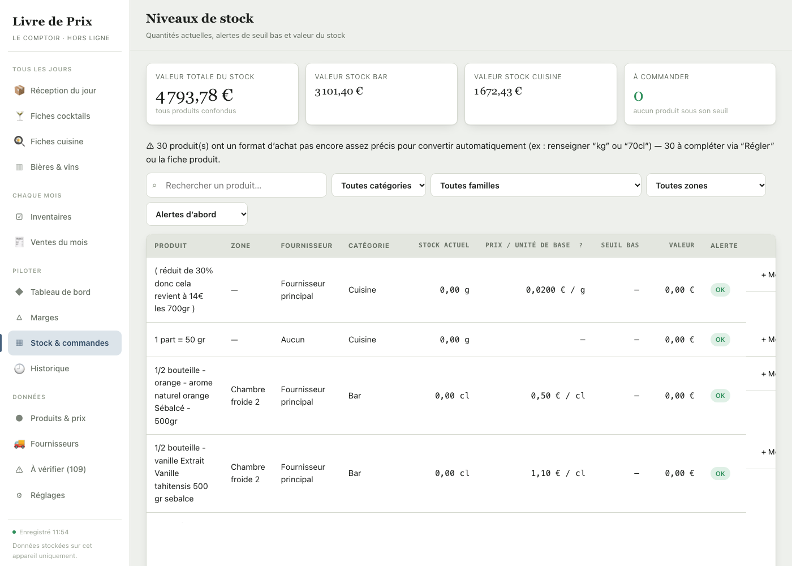
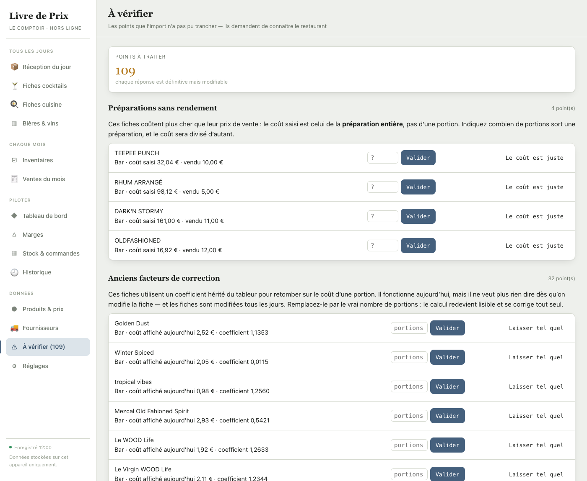

# Le Livre de Prix — guide de l'équipe

Ce guide s'adresse à toute l'équipe — cuisine, bar, salle. Aucune connaissance
en informatique n'est nécessaire. Prévois dix minutes pour le lire une fois ;
ensuite tu n'y reviendras que pour les rares gestes.

---

## 1. À quoi ça sert

Le Livre de Prix est le carnet de recettes et de prix de l'établissement, en
version écran. Il répond à quatre questions :

- **Combien nous coûte ce cocktail ou ce plat ?** — il additionne le prix de
  chaque ingrédient dans la quantité exacte de la recette.
- **Est-ce qu'on gagne assez dessus ?** — il compare ce coût au prix de vente
  et affiche un voyant vert, orange ou rouge.
- **Qu'est-ce qu'il nous reste en stock ?** — quantités, valeur, et alertes
  quand un produit descend trop bas.
- **Qu'est-ce qui a changé, et quand ?** — chaque hausse de prix fournisseur,
  chaque inventaire, chaque fiche créée est conservé.

Le principe à retenir : **tu saisis les prix d'achat une fois, et toutes les
fiches qui utilisent ce produit se recalculent toutes seules.** Si le gin
augmente de 2 €, les onze cocktails qui en contiennent voient leur marge
changer immédiatement. Personne n'a de calcul à refaire.

---

## 2. La toute première ouverture

La première fois, l'application pose trois questions rapides :

1. **Le nom de l'établissement** — il s'affichera en haut de l'écran et sur les
   fiches imprimées.
2. **Ce que vous servez** — Bar et Cuisine par défaut, mais vous pouvez
   renommer (« Salle », « Traiteur ») ou en ajouter. Chaque activité aura ses
   fiches, ses produits et ses inventaires.
3. **Les trois gestes** qui font vivre l'appli — un rappel de ce qu'on attend
   de vous au quotidien.

C'est tout. Une minute, et on n'y revient plus.

> Pour former quelqu'un plus tard, cette présentation se rouvre depuis
> **Réglages → Revoir la présentation de l'application**.

---

## 3. Ouvrir l'appli

Mets l'adresse en favori sur la tablette et sur ton téléphone. Tu peux même
mettre en favori **un écran précis** : l'adresse change quand tu navigues, donc
si tu enregistres la page pendant que tu es sur « Inventaires », ton favori
rouvrira directement les inventaires.

L'appli fonctionne sur téléphone : le menu de gauche se replie derrière le
bouton **☰** en haut à gauche.

> ☀️ **L'écran est trop sombre ou trop clair ?** **Réglages → Apparence** :
> *Clair* pour une cuisine en plein jour, *Sombre* pour un bar en soirée, ou
> *Suivre l'appareil* pour qu'il s'adapte tout seul.

> **En bas à gauche, un point coloré et une heure** indiquent que ton travail
> est enregistré. Tant qu'il affiche « Enregistré » suivi d'une heure, tout va
> bien. S'il passe au rouge, note ce que tu étais en train de faire et
> préviens la personne responsable.

---

## 4. Se repérer

Le menu de gauche est rangé **par moment d'usage**, pas par type de contenu :

| Bloc | Quand tu l'ouvres |
|---|---|
| **Tous les jours** | Saisir une livraison, consulter ou modifier une fiche technique |
| **Chaque mois** | L'inventaire, puis la saisie des ventes du mois |
| **Piloter** | Le tableau de bord, les marges, le stock, l'historique |
| **Données** | Les produits et leurs prix, les fournisseurs, les réglages |

En haut du tableau de bord, l'encadré **« À faire »** ne liste que ce qui
attend une action, et chaque ligne est cliquable. Quand il n'y a rien, il
disparaît — c'est bon signe.

En dessous, trois chiffres seulement, ceux qui veulent dire quelque chose :

- **Food cost médian** — la moitié des fiches font mieux, l'autre moitié moins bien.
- **Marge moyenne** — ce qu'on gagne en moyenne sur une fiche vendue.
- **Valeur du stock** — ce qui dort dans les réserves.

Partout dans l'appli, un petit **?** à côté d'un mot en affiche la définition
au survol. Sers-t'en pour « PRP », « food cost » ou « coefficient ».

---

## 5. Lire une fiche technique

À gauche, les ingrédients avec la quantité utilisée et ce qu'ils coûtent.
À droite, le résultat :

- **PV TTC** — le prix auquel on vend, taxes comprises. C'est le prix de la carte.
- **PRP** — ce que la recette nous coûte réellement, pertes comprises.
- **Marge HT** — ce qui reste une fois l'ingrédient payé (hors taxes).
- **Food cost** — le coût en pourcentage du prix de vente. **C'est le chiffre
  qui compte.** Plus il est bas, mieux on gagne.

Le voyant en haut à droite se lit sans réfléchir :

| Voyant | Signification | Quoi faire |
|---|---|---|
| 🟢 **Saine** | La marge est bonne | Rien |
| 🟠 **À surveiller** | On s'approche de la limite | Le signaler |
| 🔴 **Sous seuil** | On ne gagne pas assez | En parler au responsable |

Deux badges peuvent apparaître à côté du nom :

- 🧪 **lot** — recette préparée en grande quantité (un sirop, une purée) puis
  répartie. Le coût affiché est bien celui d'**une** portion.
- ⚠️ **à vérifier** — les données importées de l'ancien tableur sont
  douteuses pour cette fiche. Ne te fie pas à ses chiffres tant que quelqu'un
  ne les a pas confirmés.

### La photo du dressage

Sous le titre, un cadre **« Ajouter une photo »** : prends l'assiette en photo
avec le téléphone, et elle s'affiche sur la fiche **et sur la version
imprimée**. L'appli réduit l'image toute seule — pas besoin de s'occuper du
poids du fichier.

### Imprimer la fiche pour le poste

Le bouton **Imprimer** sort une feuille pensée pour être affichée au piano :

- le nom du plat en gros, lisible à un mètre ;
- la photo, les ingrédients et les quantités ;
- les allergènes, s'il y en a.

> **Les coûts et les marges ne s'impriment pas.** Ni les prix d'achat, ni le
> food cost, ni la courbe d'évolution. Une fiche affichée en cuisine est vue
> par tout le monde, livreurs compris — l'argent reste à l'écran.

---

## 6. Mettre à jour un prix d'achat

**C'est le geste le plus important du guide.** Une facture arrive avec un
nouveau prix ? Trente secondes suffisent, et toutes les fiches se recalculent.

1. Menu **Produits & prix**.
2. Tape le début du nom dans la barre de recherche.
3. Clique sur le produit.
4. Bouton **+ Nouveau prix**.
5. Saisis le prix, la date de la facture, et valide.

> 💡 **Pourquoi les coûts ne bougent pas d'un coup après une livraison chère ?**
> Parce que l'appli chiffre les fiches sur le **prix moyen** de ce que vous avez
> réellement payé, pondéré par les quantités reçues. Recevoir 1 000 g à 10 €/kg
> puis 200 g à 30 €/kg donne 13,33 €/kg, pas 30 €. Un achat de dépannage à prix
> fort ne fait donc plus paniquer toutes les marges. Il faut au moins deux
> livraisons saisies pour qu'une moyenne existe ; avant ça, c'est le dernier
> prix connu.

> ⚠️ **N'écrase jamais l'ancien prix : ajoute le nouveau.** L'appli conserve
> l'historique, c'est ce qui lui permet de montrer les hausses et de dire
> quand une marge s'est dégradée. Un prix corrigé par-dessus l'autre, c'est
> cette mémoire qui disparaît.

---

## 7. Ajouter un produit

1. Menu **Produits & prix** → bouton **+ Nouveau produit**.
2. Renseigne :
   - **Nom** — celui de la facture, pour le retrouver facilement.
   - **Format d'achat** — écris-le tel quel : `70cl`, `1kg`, `6 x 1,5L`.
     L'appli en déduit toute seule le prix au centilitre ou au gramme.
   - **Catégorie** — l'activité concernée (Bar, Cuisine…).
3. Enregistre, puis ajoute son premier prix comme à l'étape précédente.

> 💡 Le format d'achat est le champ à ne pas bâcler. C'est lui qui permet de
> passer du « 32 € la bouteille » au « 0,91 € les 2 cl versés dans le verre ».
> Sans lui, la fiche affichera des coûts faux.

---

## 8. Enregistrer les livraisons du jour

C'est le geste quotidien, et il tient en trois colonnes : **fournisseur,
quantité, prix**.

1. **Choisis qui a livré** en haut à gauche. La liste se réduit alors aux
   produits que ce fournisseur t'apporte d'habitude, **les plus fréquents en
   premier** — donc ceux que tu cherches sont en haut.
2. Vérifie la **date de livraison** (aujourd'hui par défaut).
3. Saisis la **quantité reçue**, et le **prix seulement s'il a changé**. Le
   prix se saisit comme sur le bon de livraison : **au kilo, au litre ou à
   l'unité** — l'appli s'occupe de la conversion.
4. Clique sur **✓ Enregistrer**.

> ✍️ **Écris les nombres comme tu les dis.** « 1,5 » avec une virgule, « 12,75 »,
> « 1 000 » avec un espace : tout est accepté. Avant, un nombre à virgule était
> refusé sans le dire et la quantité était perdue — c'était la première cause de
> stocks faux.

> ⚠️ **Si tu vois une alerte orange sous une quantité, relis-la.** L'appli
> compare ce que tu saisis à ce que ce produit reçoit d'habitude. « ⚠ 11× la
> livraison habituelle » veut presque toujours dire qu'une virgule a sauté.
> Ce n'est pas bloquant : une grosse commande exceptionnelle est légitime, c'est
> toi qui sais.

> 🔢 **Tu n'as aucune conversion à faire de tête.** Sous la quantité, un petit
> menu te laisse choisir l'unité du bon de livraison : `cl`, `L`, ou
> directement la bouteille / le carton (« 70 cl », « 1 000 g »). Tape **6**,
> choisis **70 cl**, et l'appli affiche **= 420 cl** avant que tu valides.
> C'est ce qui évite que le stock dérive.

> **La barre de recherche accepte les deux** : tape un nom de produit
> (« coriandre ») ou un nom de fournisseur (« aristide »), l'appli trouve dans
> les deux cas. Si tu tapes un nom de fournisseur, elle te le propose en un
> clic juste en dessous.

**La colonne « Comparaison » est celle qui te fait gagner de l'argent.** Dès
que tu saisis un prix, elle te dit tout de suite où tu te situes :

| Ce que tu vois | Ce que ça veut dire |
|---|---|
| 🟢 **meilleur prix** | C'est le prix le plus bas que vous ayez jamais eu |
| 🟢 **− 12 % vs Metro** | Moins cher que votre meilleur fournisseur connu |
| 🔴 **+ 22 % vs aristide** | **Plus cher** — c'est le moment d'appeler, pas dans un mois |
| 🟢 **1er prix connu** | Première fois qu'on enregistre un prix pour ce produit |

Tu n'as aucun tableau comparatif à tenir : à force de saisir les prix en
réception, l'appli sait seule qui est le moins cher sur chaque produit.

Rien n'est enregistré tant que tu n'as pas cliqué : si tu fermes la page en
cours de saisie, ni le stock ni les prix n'ont bougé.

> **Un produit livré pour la première fois ?** Bouton **+ Nouveau produit** en
> haut à droite. Crée-le, puis reviens saisir sa quantité.

> ⚠️ Cet écran sert **uniquement aux livraisons** : il ne fait qu'*ajouter*.
> Pour une casse, une perte ou une correction, passe par la fiche du produit —
> les mélanger, c'est risquer de « corriger » un stock en croyant enregistrer
> une livraison.

---

## 9. Saisir les ventes du service

C'est le pendant de la réception : la réception fait **entrer**, les ventes
font **sortir**.

Tu n'as pas à dire ce qui a été consommé — **la fiche technique le sait déjà**.
Tu indiques juste combien de fois chaque fiche a été vendue, et l'appli déduit
du stock chaque ingrédient, dans la quantité exacte de la recette.

1. Menu **Ventes du service**, vérifie la date.
2. Filtre sur **Bar** ou **Cuisine** selon ton poste.
3. En face de chaque fiche, saisis **le nombre de fois où elle a été vendue**.
4. Le tableau **« Ce qui va sortir du stock »**, en bas, montre produit par
   produit ce qui sera déduit. Relis-le avant de valider.
5. **✓ Enregistrer les ventes**.

> **Deux alertes à ne pas ignorer :**
>
> « **X ingrédient(s) non déduits** » sous une fiche : ces ingrédients n'ont
> pas de format d'achat exploitable, donc l'appli ne peut pas les décompter.
> La fiche reste utilisable, mais son stock sera incomplet.
>
> « **Stock insuffisant** » : un produit passerait en négatif. Ce n'est pas
> une erreur de saisie — ça veut dire qu'une **réception n'a pas été
> enregistrée**, ou qu'un inventaire est à refaire. Signale-le.

Une fois réceptions et ventes saisies au fil de l'eau, l'inventaire de fin de
mois ne sert plus à découvrir le stock, mais à **vérifier** : l'écart entre le
théorique et le compté devient la vraie mesure des pertes et de la casse.

---

## 10. L'inventaire de fin de mois

Un inventaire, c'est compter ce qu'il y a vraiment sur les étagères et le
comparer à ce que l'appli croyait avoir.

1. Menu **Inventaires** → **+ Nouvel inventaire**.
2. Choisis la date et la catégorie (Bar / Cuisine). Tu peux aussi cibler une
   **zone** précise — chambre froide 1, cave, réserve sèche. Une zone à la
   fois, c'est plus rapide et on se trompe moins.
3. Laisse **« Pré-remplie »** : la fiche de comptage arrive avec **tous les
   produits concernés déjà listés, rangés par famille**. Tu n'as que les
   quantités à saisir.
4. Descends la liste et saisis ce que tu comptes. **Laisse vide tout ce que tu
   ne comptes pas** — ces produits seront ignorés et leur stock ne bougera pas.
5. En haut, un compteur indique où tu en es : « 12 produits comptés sur 176 ».
6. Quand tu as fini : **✓ Valider l'inventaire**.

Le menu **Ranger par** en haut réorganise la liste : par famille, par zone de
rangement, ou en une seule liste alphabétique. Choisis ce qui suit le mieux
ton parcours physique dans les réserves.

> ⚠️ **Attention à l'unité au comptage.** Le stock d'une bouteille de 75 cl est
> compté **en cl**, pas en bouteilles. Si tu saisis « 3 » pour trois bouteilles,
> l'appli affiche « ⚠ très en dessous du stock attendu — vérifier l'unité ».
> L'unité attendue est rappelée sur chaque ligne.

> **Tu trouves un produit absent de la liste ?** La barre de recherche en haut
> permet de l'ajouter au comptage, et de le créer s'il n'existe pas encore
> dans l'appli.

> La validation met les stocks à jour et enregistre chaque écart dans
> l'historique. Tant que tu n'as pas validé, tu peux fermer et revenir plus
> tard : rien n'est perdu, rien n'est encore appliqué.

Un écart important n'est pas forcément une erreur de comptage : casse, perte,
oubli de saisie d'une réception. Signale-le plutôt que de le corriger en
silence.

---

## 11. Suivre le stock au quotidien

L'écran **Niveaux de stock** liste ce qu'il reste, filtrable par catégorie,
famille ou zone de rangement.

Pour tout ce qui n'est **pas** une livraison — une bouteille cassée, une
perte, une correction — ouvre la fiche du produit et enregistre le mouvement
en choisissant son type : **perte**, **casse** ou **réglage manuel**. Chaque
mouvement est daté et conservé.

Si on renseigne un **seuil bas** sur un produit, l'appli le signale dès qu'il
passe en dessous, et l'écran **Suggestions de commande** regroupe alors tout
ce qu'il faut racheter, fournisseur par fournisseur, avec le coût estimé.

---

## 12. Les erreurs qu'on peut faire sans risque

L'appli est difficile à casser, et il vaut mieux essayer que ne rien saisir :

- **Te tromper dans une saisie** — tout est modifiable, rien n'est définitif.
- **Créer une fiche en double** — supprime-la, sans conséquence.
- **Fermer la fenêtre en plein travail** — c'est enregistré au fur et à mesure.

Les trois seules choses qui demandent de l'attention :

1. **Écraser un prix au lieu d'en ajouter un** — ça efface l'historique.
2. **Enregistrer deux fois la même livraison** — le stock est augmenté deux
   fois. En cas de doute, vérifie l'**Historique** avant de ressaisir.
3. **Supprimer un produit utilisé dans des fiches** — les fiches concernées
   perdent une ligne. La fiche produit indique toujours dans combien de
   recettes il est utilisé : vérifie avant.

Laisser des lignes vides dans un inventaire n'est **pas** une erreur : c'est
prévu. Ces produits sont simplement ignorés.

---

## 13. L'écran « À vérifier »

Dans le menu **Données**, un écran regroupe tout ce que l'appli n'a pas pu
décider seule au moment de la reprise des anciens tableurs. Le chiffre à côté
du nom indique ce qu'il reste à traiter.

Ce ne sont pas des bugs : ce sont des questions auxquelles **seul quelqu'un du
restaurant peut répondre**.

| Section | La question posée |
|---|---|
| **Préparations sans rendement** | Cette préparation sort combien de portions ? |
| **Anciens facteurs de correction** | Idem — ces coefficients marchent aujourd'hui, mais se dérèglent dès qu'on modifie la fiche |
| **Lignes de récapitulatif** | Ce total recopié du tableur fait-il double emploi, ou est-ce un vrai coût (emballage, cuisson) ? |
| **Formats d'achat manquants** | Que contient le conditionnement ? Un carton de 500 pailles → « 500 unités » |
| **Produits en double** | Ces deux lignes sont-elles le même produit ? |
| **Prix inhabituels** | Ce prix très élevé est-il correct ? |

> **Chaque point a une sortie « c'est normal »** — « Le coût est juste »,
> « Laisser tel quel », « Produits différents ». Le point disparaît sans que
> rien ne soit modifié. Aucune obligation de tout changer.

> ⚠️ **Traite les « anciens facteurs de correction » avant les « lignes de
> récapitulatif ».** Un coefficient a été calculé avec la ligne en place :
> retirer la ligne d'abord fausse le résultat. L'écran te le signale sur les
> fiches concernées.

Cet écran resservira : si un jour une fiche coûte plus cher qu'elle ne se
vend, ou qu'un produit arrive sans format d'achat, il réapparaîtra ici.

---

## 14. En cas de souci

| Ce que tu constates | Ce que ça veut dire |
|---|---|
| L'indicateur en bas à gauche est rouge | L'enregistrement a échoué — préviens le responsable, ne continue pas à saisir |
| Une fiche affiche un coût aberrant | Le format d'achat d'un ingrédient est faux ; regarde si le badge ⚠️ « à vérifier » est présent |
| Un produit est introuvable | Il est peut-être rangé dans l'autre catégorie — mets le filtre sur « Toutes » |
| Les chiffres semblent anciens | Recharge la page |

Pour toute question sur les prix eux-mêmes ou les marges, adresse-toi au
responsable — pas de modification de prix de vente sans validation.
